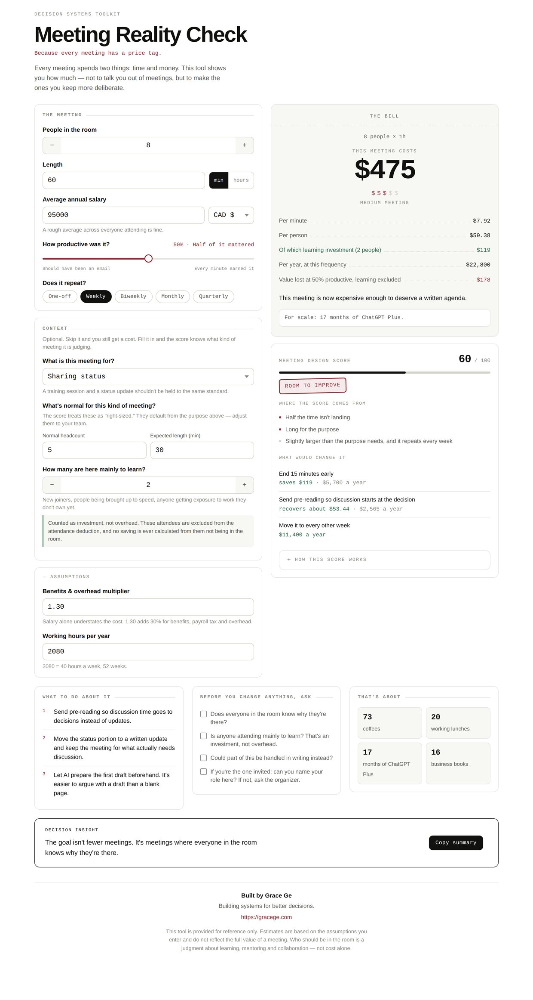

# Meeting Reality Check

Part of the [Decision Systems Toolkit](https://github.com/Grace-RGe/decision-systems-toolkit/tree/main).

**Live demo:** https://gracege.com/tools/meeting-reality-check/toolkit

Work out what a meeting actually costs, then judge whether it was *designed* well — not just whether it was expensive.

- **The bill** — labour cost of the meeting, per minute, per person, and per year if it recurs. An honest number, shown in full.
- **Meeting design score** — 0–100, starting at 100 with four deductions: attendance, length, productivity, and recurrence. The scoring rules are shown in the tool, in full.
- **Purpose-aware** — a training session and a status update aren't held to the same standard; the purpose you pick sets the baselines the score judges against.
- **Levers, not blame** — concrete changes that would improve the meeting (end earlier, split attendance by relevance, move weekly to biweekly), each with the saving attached.

**[English version](meeting-reality-check-en.html)**

**[中文版](meeting-reality-check-cn.html)**

## Notes on the design

A meeting cost calculator is a dangerous thing to build. Built carelessly, it hands someone a number that makes exclusion look like arithmetic. This one is built so it can't be used that way:

- People marked as attending **to learn** are excluded from the attendance penalty, shown on their own line as investment, and no saving is ever calculated from them not being in the room.
- The score is a heuristic, not a verified instrument — 100 minus four deductions, kept deliberately simple so it can be explained and challenged. **Cost is not part of it:** an expensive meeting can be well designed, and a cheap one can be a waste.
- Productivity is a subjective self-report and moves the score by up to 34 points. It measures what you felt, not what was measured.
- The "reduce attendance" recommendation was removed entirely — not softened. The tool diagnoses when a room is larger than its purpose needs, but never hands you that move.
- All logic runs in plain JavaScript, offline, with no dependencies.

That last promise is checkable, not just stated. The guard test in [`test/`](test/) sweeps the full grid of inputs — 3,840 combinations per language — and asserts that no recommendation the tool produces ever proposes removing people. Run it with `npm test`.
